# Git & GitHub — Mastery Notes (Lectures 3 & 4)

> **Scope:** These notes cover everything taught in the two Git/GitHub sessions — what version control is, core Git commands, undoing mistakes, branching, merging, merge conflicts, rebasing, and collaborating via GitHub (collaborators + the fork-and-PR workflow). Nothing from later web-dev topics (Tailwind, React, backend) is included here, so there's no overlap.

---

## 0. Why Does Version Control Exist? (Start with the Problem, Not the Tool)

Before learning *how* Git works, you need to feel *why* it had to be invented. Imagine a team without it:

| Problem (without version control) | What goes wrong |
|---|---|
| **Multiple people editing the same file** | Person A changes lines 5–10. Person B, working blind, accidentally overwrites those same lines with their own work. A's work is silently gone. |
| **Merging everyone's work** | 10 people each write a feature. Someone now has to manually figure out how to combine 10 sets of changes into one final file — a nightmare by hand. |
| **No accountability / history** | A bug appears. Who wrote this line? When? Why? Nobody knows — there's no trail. |
| **Unsafe open-source collaboration** | If anyone could directly edit a popular project's live code, one bad actor could break it for everyone, instantly. |

**Version control software solves all four** by doing one core thing: **tracking every change to every file over time**, recording *who* changed *what*, *when*, and (via commit messages) *why*. Branching and pull requests (covered later) build a *safety layer* on top of this so changes can be reviewed before they affect anyone else.

> **The one-line definition to give in an interview:** *"Version control is a system that tracks the history of changes to a codebase over time, enabling multiple people to collaborate safely without overwriting each other's work."*

---

## 1. Centralized vs. Distributed Version Control

There are two architectural philosophies. Git belongs to the second one, and understanding *why* it won is itself a common interview talking point.

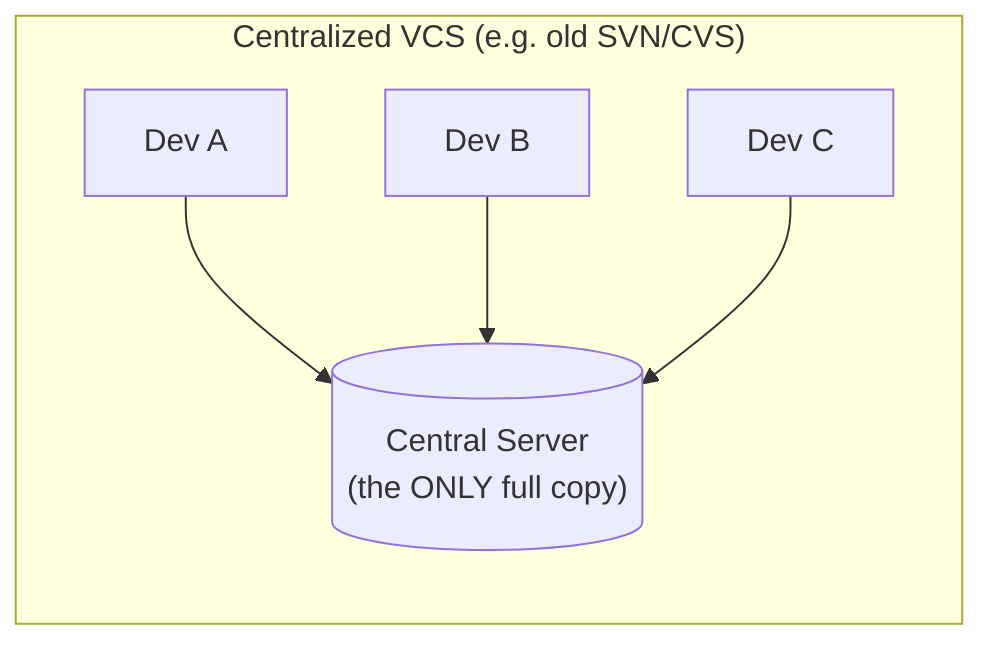

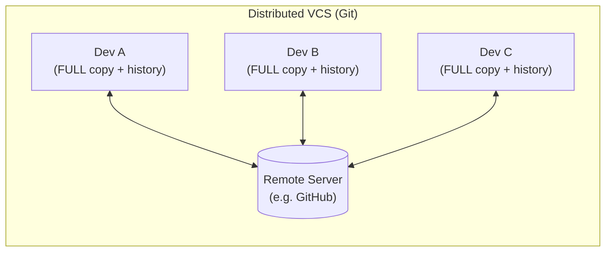

| | Centralized | Distributed (Git) |
|---|---|---|
| Where's the full history? | Only on the central server | On **every single developer's machine** |
| What if the server goes down? | Nobody can commit, branch, view history, or work at all | Doesn't matter — everyone keeps working locally; you only need the server to *sync* with others |
| Need internet for most operations? | Yes, constantly | No — only for `push`/`pull`/`fetch` (syncing). Committing, branching, viewing history, diffing — all 100% offline |

> **Interview gap-fill:** This is *the* reason Git became dominant. A local commit is just writing to your own disk — instant, and works on a plane with no WiFi. A centralized system has to talk to the server for nearly everything.

---

## 2. How Git Actually Stores History: Snapshots, Not Diffs

Older version control tools (and the mental model most beginners *assume* Git uses) store history as a chain of **diffs** — "what changed between version N and N+1."

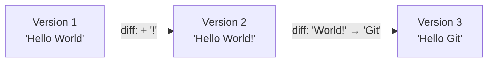

To rebuild Version 3 under this model, the tool has to start at Version 1 and *replay every diff in order* — like rebuilding a recipe by reading a long list of edits to a previous recipe.

**Git does something fundamentally different: it stores a full snapshot of your entire project at every commit.**

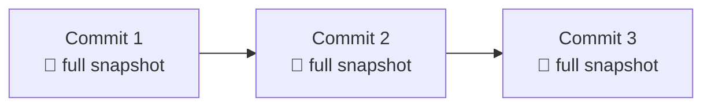

> **Think of it like a video game save file**, not a list of patch notes. Want to load Version 3? Git just opens the Version-3 snapshot directly — no replaying required.

**Doesn't storing a full snapshot every time waste tons of space?** Surprisingly, no — Git is clever internally: if a file hasn't changed between commits, Git just *reuses a pointer* to the existing file data rather than storing it again. So conceptually you get the simplicity of "every commit = a full snapshot," with the storage efficiency of "only changed files actually take new space" under the hood.

---

## 3. Terminal Basics (You'll Use These Constantly)

| Command | What it does | Mental model |
|---|---|---|
| `ls` | List files/folders in current directory | "What's in this room?" |
| `ls -la` | List **everything**, including hidden files (like `.git`), with details | "Show me even the secret stuff, in detail" |
| `cd <folder>` | Change directory (move into a folder) | Double-clicking into a folder |
| `mkdir <name>` | Make a new folder | Right-click → New Folder |
| `touch <file>` | Create a new empty file | Right-click → New File |
| `rm <file>` | Delete a file | Drag to trash |

---

## 4. Installing & Configuring Git

```bash
git --version          # confirms Git is installed (shows version number)
git config --global user.email "you@example.com"
git config --global user.name "Your Name"
git config --global --list    # confirms what you just set
```

**Why configure this at all?** Every commit needs an author. When Git later shows "who changed this line, and when" (critical for debugging and accountability — see §0), it's reading *this* identity information. `--global` means "use this identity for every Git project on this machine," not just one.

---

## 5. The Three Trees: Working Directory → Staging Area → Repository

This is the single most important mental model in Git. Almost every command you'll ever run is about moving content **between these three areas**.

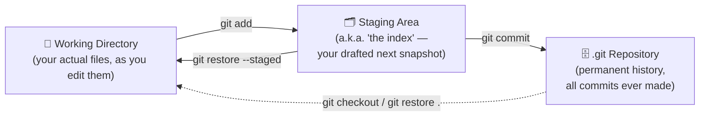

| Area | Analogy | Command that puts things here |
|---|---|---|
| **Working Directory** | Your messy desk — actively editing | Just... editing files in your editor |
| **Staging Area** | An envelope you're packing, deciding exactly what goes in the next "save" | `git add <file>` |
| **.git Repository** | A sealed, permanent vault of every save ever made | `git commit -m "message"` |

> **Why does the Staging Area exist at all? Why not commit directly?** It gives you a **deliberate checkpoint** to review exactly what will be saved. You might have changed 5 files but only want 2 of them in this particular commit (because they're a complete, related unit of work, and the other 3 are unrelated half-finished edits). Staging lets you *curate* each snapshot instead of being forced to commit everything you've touched.

---

## 6. The Core Loop: `init` → `status` → `add` → `commit`

```bash
git init                       # start tracking this folder as a Git repo (creates hidden .git/ folder)
git status                     # "what's the current state of my 3 trees?"
git add index.html             # working directory → staging area
git add .                      # shortcut: stage EVERYTHING that changed
git commit -m "Added index.html"   # staging area → permanent snapshot in .git
git log                        # view the history of commits
```

### Reading `git status` output

| Status label | Meaning |
|---|---|
| `Untracked` | Git sees this file exists but has **never** been told to track it (brand new file, never `git add`-ed) |
| `Modified` (unstaged) | Git already tracks this file, and it changed since the last commit, but you haven't `git add`-ed the change yet |
| `Changes to be committed` | The file is staged — it **will** be included in your next commit |
| `nothing to commit, working tree clean` | Everything that's tracked matches the last commit exactly — no pending work |

### What's actually inside a commit, and what is a "commit hash"?

Every commit bundles together:
- A pointer to the full project snapshot (the "tree")
- A pointer to its **parent commit(s)** — this is what chains commits into history
- Author name, email, timestamp
- The commit message

All of this is run through a hashing algorithm (SHA-1) to produce a unique fingerprint — the **commit hash** (e.g. `a3f5e9c...`). This is your unique ID for that exact snapshot.

> **Interview gap-fill — why this matters more than it seems:** Because the parent's hash is part of what gets hashed into the *child* commit, **changing anything about an old commit (even just editing its message) generates an entirely new hash** for that commit *and every commit after it*. This single fact explains several things you'll see later: why `git commit --amend` produces a different hash, and why rewriting history that others have already pulled (via amend/rebase) is dangerous — their copy now has commits with completely different hashes than yours, and the two histories diverge. This is sometimes called **"Git's Golden Rule": never rewrite (amend/rebase) commits that have already been pushed and shared with others.**

---

## 7. Undoing Things *Before* You Commit

These commands operate **between the three trees** — for mistakes you catch before they're sealed into a permanent commit.

| Situation | Command | Effect |
|---|---|---|
| I staged a file, but I want to un-stage it (keep the edits, just don't commit yet) | `git restore --staged <file>` | Staging Area → back to Working Directory |
| I want to throw away *all* my uncommitted edits to a file and go back to the last commit's version | `git restore <file>` | Discards working directory changes for that file |
| I want to throw away **all** uncommitted changes, every file | `git restore .` | Full "give me a fresh start" reset of the working directory |

> **Modern Git note:** Older tutorials use `git checkout -- <file>` for this same purpose — `checkout` historically did *everything* (switching branches, restoring files, even detaching HEAD), which was confusing. Modern Git split this into `git switch` (for branches) and `git restore` (for files) specifically to make intent clearer. Both still work; `restore`/`switch` are just the newer, less ambiguous commands.

---

## 8. Comparing Any Two Commits: `git diff`

```bash
git diff <commit-hash-1> <commit-hash-2>
```

Shows exactly which lines were added (`+`, shown in green) and removed (`-`, shown in red) between two snapshots. You'll use this constantly — both to review your own work before committing, and to understand what someone else changed.

---

## 9. Time Travel: Undoing *Already-Committed* Work

Once something is committed, "undoing" it is a bigger decision than restoring a file — you have two fundamentally different tools, and **choosing the wrong one for the situation is a classic real-world mistake**.

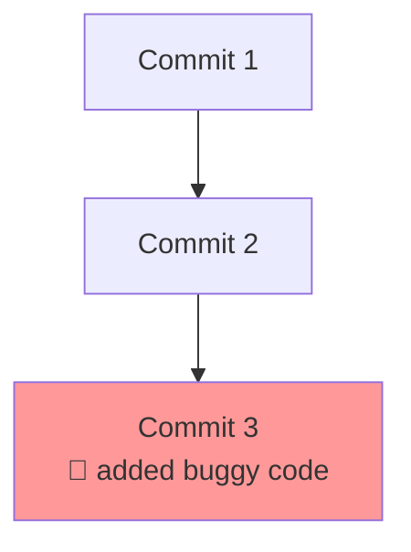

### Option A — `git revert <hash>`: the *safe*, *public-history-friendly* undo

```bash
git revert <commit-hash-of-the-bad-commit>
```

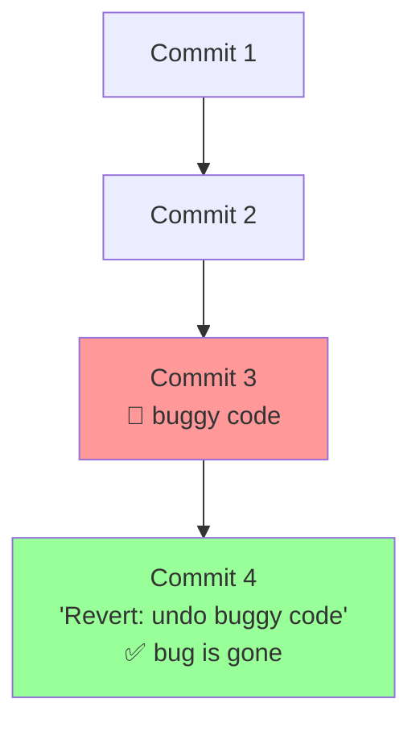

- Creates a **brand-new commit** that contains the *inverse* of the bad commit's changes.
- The bug is gone from your current code.
- **The bad commit is still visible in history** — nothing is erased, you can always see it happened and when.

> **Use `revert` when the commit has already been pushed/shared** — it adds to history instead of rewriting it, so nobody else's copy of the repo conflicts with yours.

### Option B — `git reset <hash>`: rewinds history itself

Two flavors, and the difference between them is one of the most-asked Git interview questions:

```bash
git reset --soft <commit-hash>   # rewind history, but KEEP the changes (staged)
git reset --hard <commit-hash>   # rewind history, and DESTROY the changes — gone forever
```

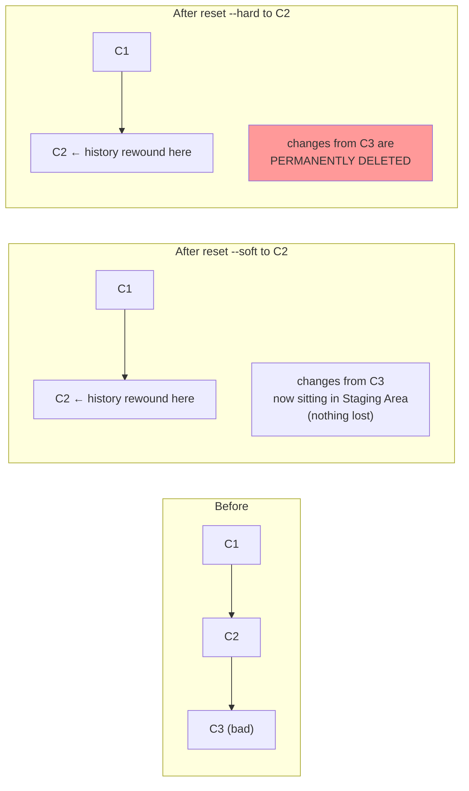

| | `git revert` | `git reset --soft` | `git reset --hard` |
|---|---|---|---|
| Creates a new commit? | ✅ Yes | ❌ No — deletes commits from history | ❌ No — deletes commits from history |
| Original commit stays visible in `git log`? | ✅ Yes | ❌ No | ❌ No |
| What happens to the changes themselves? | Inverse applied as a new commit | Moved into the Staging Area (recoverable) | **Deleted permanently** |
| Safe to use on commits already pushed/shared with others? | ✅ Yes | ⚠️ Risky | ⚠️ Risky |
| Best used for | Undoing something everyone already has | Cleaning up your **own, not-yet-shared** recent commits | Same, when you're 100% sure you want the changes gone too |

> **Interview-ready summary line:** *"`revert` is the safe option because it preserves history and adds a correction — use it once code has been shared. `reset` rewrites history and should be reserved for commits that are still entirely local and unpushed; `--soft` keeps your changes recoverable in staging, `--hard` deletes them outright, so `--hard` should always be used with caution."*

---

## 10. Pausing Unfinished Work Safely: `git stash`

**The real scenario:** you're mid-way through a feature — not done, definitely not "commit-worthy" yet — and your manager says *"drop everything, fix this urgent bug on another branch right now."* Switching branches with uncommitted work sitting around is risky. You don't want to make a sloppy, unfinished commit just to save your progress. What do you do?

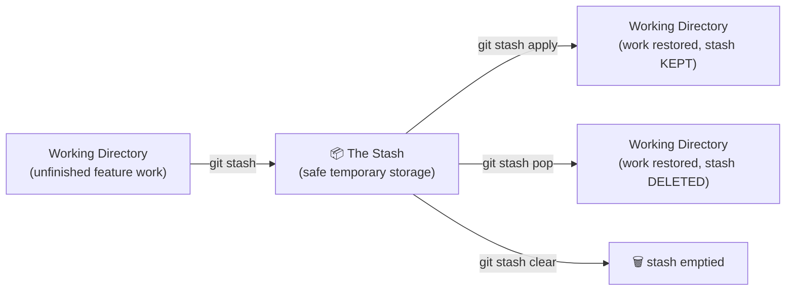

```bash
git stash            # tuck away all uncommitted changes into a temporary "box"
# ... go switch branches, fix the urgent bug, come back ...
git stash apply      # restore the stashed changes (stash itself is kept, for safety)
git stash pop        # restore the stashed changes AND remove them from the stash in one step
git stash clear       # permanently empty out everything in the stash
```

> **`apply` vs `pop` — the distinction worth remembering:** `apply` is the cautious version (keep a backup in the stash just in case something goes wrong restoring it); `pop` is the everyday convenience version (restore + clean up in one move). Most developers default to `pop`.

---

## 11. Fixing Commit Messages & Mistakes: `git commit --amend`

```bash
git commit --amend -m "Corrected, meaningful commit message"
```
Replaces the **most recent** commit's message with a new one (and, internally, generates a brand-new commit hash — see §6's gap-fill on why).

**Forgot to include a file in your last commit?**

```bash
git add forgotten-file.html
git commit --amend --no-edit   # adds the staged file into the LAST commit, keeping the same message
```

> **Interview gap-fill — the one rule that governs all of this:** `--amend` rewrites the most recent commit (new hash, as established earlier). **This is only safe if that commit hasn't been pushed/shared yet.** If you amend a commit others have already pulled, your history and theirs now permanently disagree — same "Golden Rule" as `reset`/`rebase`.

---

## 12. Branching — The "Why" Before the "How"

### The Core Problem Branching Solves

Imagine 10 developers all committing directly to one shared timeline (called the **`main`** branch, which typically also powers the live, production website). One person's half-tested change could break the live site for everyone, instantly.

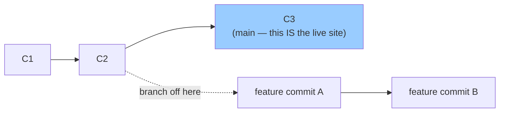

**The rule:** never commit experimental/in-progress work directly to `main`. Instead, branch off, build and test your feature in isolation, get it reviewed, and only *then* bring it into `main`.

> **What is a branch, really, under the hood?** This is a commonly under-explained but interview-favorite detail: **a branch is not a copy of your project.** It's just a small, lightweight **pointer** (literally a tiny file containing a single commit hash) that says "this branch currently points to commit X." That's why creating a branch in Git is instant and essentially free, no matter how huge your project is — you're creating a pointer, not duplicating gigabytes of files. When you make a new commit while on that branch, Git just moves the pointer forward to the new commit.

### `HEAD` — One More Pointer to Know

`HEAD` is a special pointer that tracks **"which branch (or commit) am I currently looking at / would my next commit attach to?"** When you switch branches, you're really just moving `HEAD` to point at a different branch pointer.

### Creating and Switching Branches

```bash
git branch                  # list all branches; * marks which one you're currently on
git checkout -b add-styles  # CREATE a new branch called "add-styles" AND switch to it, in one command
git checkout main           # switch back to the main branch
git branch -d add-styles    # delete a branch (only allowed if it's already merged — Git protects you here)
git branch -D add-styles    # FORCE delete, even if unmerged (you'll lose those commits if not merged elsewhere)
```

> Equivalent modern command: `git switch -c add-styles` (create+switch) and `git switch main` (switch) — introduced to make branch-switching unambiguous, separate from file-restoring (`git restore`).

**Crucial detail to internalize:** the moment you branch off, your new branch contains **the entire commit history up to that point** — because, again, a branch is just a pointer, and `git log` simply walks backward through parent commits from wherever the pointer (and `HEAD`) currently sits. Any *new* commits made on the branch only exist on that branch's pointer chain — switch back to `main`, and Git swaps your working directory's files to match wherever `main`'s pointer is, so those new files/changes disappear from view (they're not deleted — they're just on a different timeline you're not currently looking at).

---

## 13. Merging — Bringing a Branch's Work Back In

```bash
git checkout main        # 1. Be ON the branch you want to merge INTO
git merge add-styles      # 2. Pull all of add-styles's work into main
```

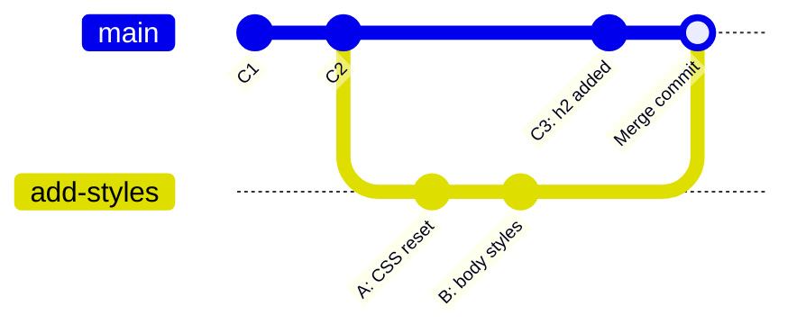

**What just happened, in plain English:** Git took everything new from `add-styles` (commits A and B) and combined it with everything new that had *also* happened on `main` in the meantime (commit C3) — producing a brand-new **merge commit** that has **two parents** instead of the usual one. This merge commit is what makes `git log`/`git lens`-style graphs show that "branching diamond" shape.

> **Interview gap-fill — fast-forward vs. true merge:** If `main` had received **zero** new commits since the branch point (i.e., nobody added C3), Git doesn't need to combine two diverging timelines at all — it just slides the `main` pointer forward to wherever `add-styles` ended up. This is called a **fast-forward merge**, and notably **no new merge commit is created**. A real two-parent merge commit only happens when *both* branches have moved forward independently and need to be reconciled — exactly the scenario above.

### Merge Conflicts — When Git Can't Decide For You

A conflict happens when **the same lines of the same file** were changed differently on both branches being merged.

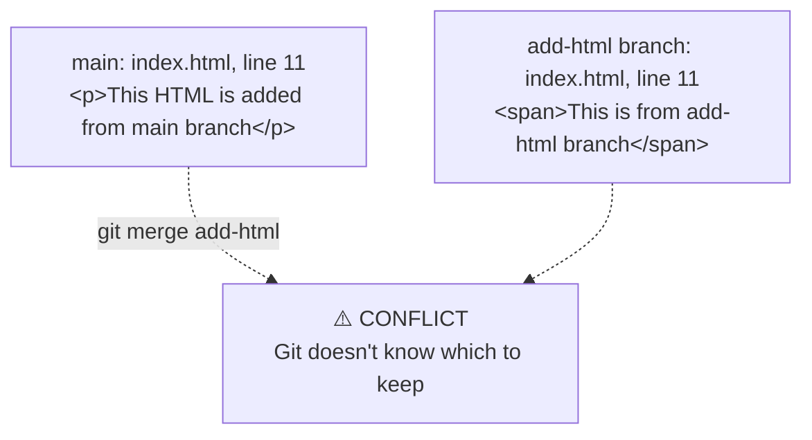

Git marks the conflicting section directly inside the file:

```html
<<<<<<< HEAD
<p>This HTML is added from main branch</p>
=======
<span>This is from add-html branch</span>
>>>>>>> add-html
```

| Marker | Meaning |
|---|---|
| `<<<<<<< HEAD` | Start of **your current branch's** version |
| `=======` | Divider between the two competing versions |
| `>>>>>>> add-html` | End marker, labeled with the **incoming branch's** version |

**Resolving it is a manual, human decision:**
1. Open the file, look at both versions.
2. Edit it to whatever the *correct final result* should be (keep one side, keep both, write something new entirely — your call).
3. **Delete all three marker lines** (`<<<<<<<`, `=======`, `>>>>>>>`) — leaving them in is a common beginner mistake that breaks the file.
4. `git add <file>` (stage your resolution)
5. `git commit` (completes the merge with a merge commit)

> **Interview framing — why does this happen, and is it a "Git bug"?** No — it's a *feature*. Git is purely mechanical and can do automatic merging only when changes don't overlap (e.g., one branch added a line at the *end* of a file while another changed something near the *top* — no real conflict, Git merges both automatically). The moment two humans genuinely changed *the same spot* differently, only a human can correctly decide intent — Git correctly refuses to guess.

---

## 14. Rebasing — Rewriting History Into a Straight Line

`git merge` preserves the *true, messy* shape of how work actually happened (branches, merge points, everything). `git rebase` instead **rewrites history to look like the branch's commits happened in a straight line on top of main, as if no branching ever occurred.**

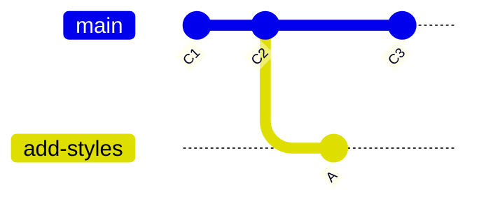
*(Before — the real, branching shape of history)*

After `git rebase main` (run while on `add-styles`):

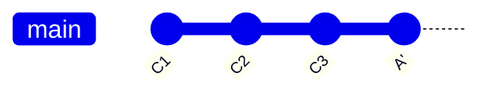
*(After — A is replayed on top of C3, as if it had been written there all along. Note: this is a brand-new commit, "A′", not the original "A" — same content, but a completely new hash, because its parent is now different.)*

### How Rebase Actually Works, Step by Step

```bash
git checkout add-styles   # 1. be on the branch you want to move
git rebase main            # 2. replay each of THIS branch's commits, one at a time, on top of main's latest commit
```

Git takes each commit on your branch **in order** and tries to re-apply it on top of the new base:
- If a commit applies cleanly → moves to the next one automatically.
- If a commit conflicts → **pauses rebasing**, gives you the same conflict markers as a merge conflict, and waits.

```bash
# ... resolve the conflict in the file(s) manually ...
git add <resolved-file>
git rebase --continue       # replay the NEXT commit in the sequence
# repeat resolve → add → continue for every commit that conflicts
```

If there are 4 commits to replay, you might go through this resolve-and-continue cycle up to 4 separate times — once per commit — because each one is being individually re-applied to a constantly-shifting "current tip."

### Bringing `main` Up to Date After Rebasing

Rebasing `add-styles` onto `main` only updates the `add-styles` branch pointer — `main` itself hasn't moved yet:

```bash
git checkout main
git merge add-styles   # since add-styles's history is now a straight continuation of main, this is a FAST-FORWARD — no merge commit needed
```

> Note: some workflows (including the lecture's own walkthrough) use `git rebase add-styles` again while on `main` to achieve the same fast-forward result — functionally it lands you in the same place, but `git merge <branch>` after a successful rebase is the more conventional/idiomatic command here, since by this point there's nothing left to "rebase," just a straight pointer move.

### ⚠️ The Golden Rule of Rebasing (critical, and the #1 gap in most beginner explanations)

> **Never rebase commits that have already been pushed and shared with other people.**

Why? Because rebase **doesn't move the original commits — it deletes them and creates brand-new ones with different hashes** (just like `reset`/`amend`, per §6's hashing explanation). If a teammate already pulled the *old* version of your branch, and you rebase and push the *new* version, Git sees these as two genuinely different, conflicting histories — not "the same work, slightly reorganized." This causes serious confusion and broken collaboration. **Rebase is for your own local, not-yet-shared commits. Once it's public, use merge (or revert) instead.**

---

## 15. Merge vs. Rebase — Full Comparison

| | `git merge` | `git rebase` |
|---|---|---|
| History shape | Preserves the real, branching shape — you can see exactly when/where branches diverged and rejoined | Rewrites into a clean, straight line — looks like it always happened sequentially |
| New commit created? | Yes, a merge commit (when not fast-forwardable) | No new commit — original commits are deleted, replaced with new ones with new hashes |
| Safe on shared/pushed branches? | ✅ Always safe | ⚠️ Only safe on local, unpushed work |
| Conflict resolution | One resolution, covering the whole combined diff | Potentially multiple rounds — one per commit being replayed |
| Team culture | "I want to see exactly how this happened, warts and all" | "I want a clean, readable, linear history" |

> **There is no universally "correct" choice** — interviewers want to see that you understand the *trade-off* (clarity of true history vs. a clean linear log), not that you've memorized one as "the right answer." Many real teams use a mix: rebase your own local feature branch to keep it tidy *before* it's ever pushed, then merge (or squash-merge, a related strategy not covered in this lecture but worth knowing exists) once it's ready to go into the shared `main`.

---

## 16. GitHub — Connecting Your Local Repo to a Remote One

**GitHub is not Git.** Git is the version control *software* running on your machine. GitHub is a **hosting service** for Git repositories on the internet — it gives your local repo a home that others can access, browse, and collaborate on. (Alternatives: GitLab, Bitbucket — same core idea, different platform.)

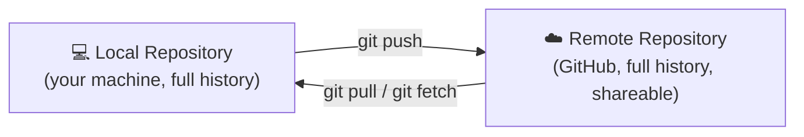

### Linking them together

```bash
git remote add origin https://github.com/you/your-repo.git
git remote -v               # confirms the link, shows fetch & push URLs
git push -u origin main     # first-ever push: uploads everything, AND sets up tracking
git push                    # every push after that — no need to repeat origin/main
```

| Term | Meaning |
|---|---|
| `git remote add` | "Register a remote repository address under a nickname" |
| `origin` | Just a **nickname** for the remote URL — convention, not a keyword; you could call it anything |
| `-u` (a.k.a. `--set-upstream`) | Links your local branch to a specific remote branch **once**, so future `git push`/`git pull` know where to go automatically, without you re-typing the remote and branch name every time |

---

## 17. Push, Pull, and Fetch — Keeping Local and Remote in Sync

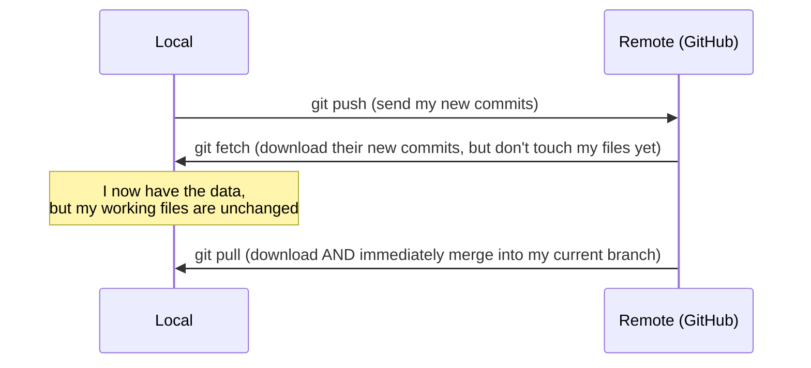

| Command | What it does |
|---|---|
| `git push` | Upload your local commits to the remote |
| `git fetch` | Download the remote's new commits **into your local repository's history** — but does **not** touch your current working files or branch |
| `git pull` | `git fetch` **+** `git merge`, automatically, in one step — downloads *and* immediately integrates the changes into your current branch |

> **Interview gap-fill — why would you ever use `fetch` instead of the more convenient `pull`?** `fetch` lets you **look before you merge** — you can inspect what changed remotely (`git log`, `git diff`) before deciding to bring it into your own working branch. `pull` is faster for the common case but merges blindly and immediately; in a sensitive shared branch, some developers deliberately `fetch` first to review, then merge manually when ready.

**Important:** none of this syncing is automatic. Make a local commit → it stays local until you `push`. Someone else pushes to GitHub → you won't see it locally until you `pull` (or `fetch`+`merge`).

---

## 18. Collaboration Model 1 — Trusted Collaborators

For a small, trusted team, the repository owner can grant direct push access:

**GitHub → Repo → Settings → Collaborators → add by username → they accept an email invite.**

Once added, a collaborator can `git push` directly to the shared repository — exactly like the owner can. This works well for small teams (5–10 people who know and trust each other) but **doesn't scale** to open-source projects with thousands of potential contributors you've never met — you can't hand out direct write-access to total strangers.

---

## 19. Collaboration Model 2 — Fork & Pull Request (The Open-Source Workflow)

This is how virtually **every open-source contribution** on GitHub works, and it's worth knowing cold for interviews — it's a near-universal industry workflow, not specific to this lecture's toy example.

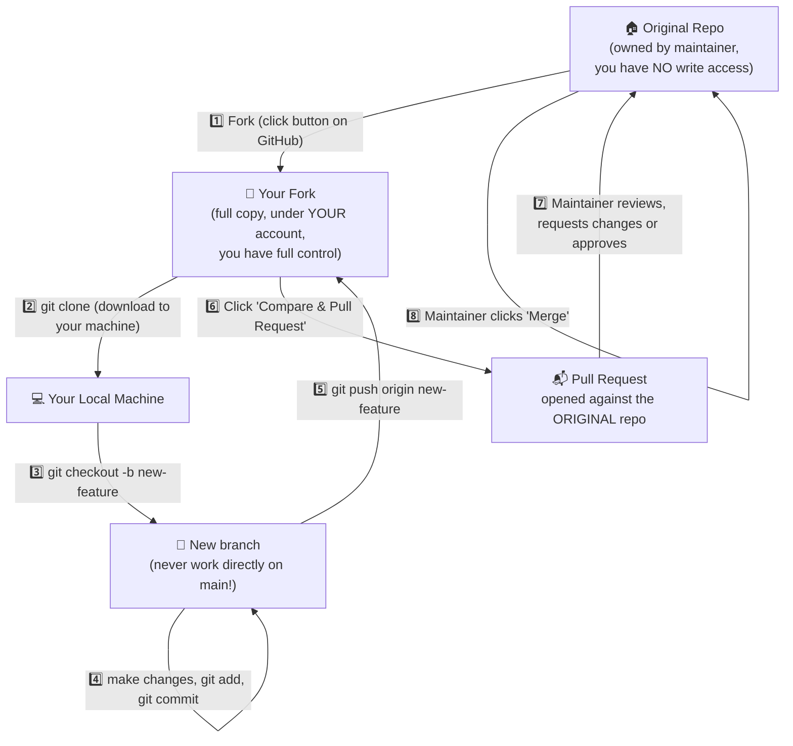

### Why fork at all, instead of just cloning the original?

Because you don't have write access to the original repository (by design — see §0's "unsafe open-source collaboration" problem). **Forking creates a completely independent copy under your own account**, where you have full control. You can break it, experiment, even delete everything — the original project is entirely unaffected, because it's a separate repository. Only once you explicitly open a Pull Request does the maintainer of the *original* repo even see your proposed changes — and they choose whether to accept them.

### The Step-by-Step Recipe

```bash
git clone https://github.com/you/forked-repo.git   # 1. download YOUR fork locally
cd forked-repo
git checkout -b add-my-name                          # 2. NEVER work directly on main — branch first
# ... make your edits ...
git add .
git commit -m "Add your name to contributors list"   # 3. follow the project's commit-message convention (check its README!)
git push origin add-my-name                            # 4. push your branch to YOUR fork (not the original!)
```

Then, on GitHub: open your fork → you'll see a **"Compare & Pull Request"** button → fill out the PR template (most real projects provide one) → submit.

### What Happens After You Open a PR

The maintainer can:
- **Approve and merge** — your commits become part of the original project.
- **Request changes** — comment on specific lines, ask you to fix something; you push more commits to the *same branch*, and they automatically appear in the same open PR.
- **Close without merging** — if it doesn't fit the project.

> **The README.md is your map.** Virtually every real open-source repository documents its exact contribution process (how to set up the project locally, branch naming conventions, commit message format, PR checklist) in `README.md` or `CONTRIBUTING.md`. Reading it *first* avoids wasted PR review cycles.

---

## 20. The Missing Piece: `.gitignore`

The lecture mentioned wanting to avoid committing a secret/API key — this is precisely the problem `.gitignore` solves, and it's worth knowing explicitly even though the lecture didn't name the file directly.

Create a file named exactly `.gitignore` in your project root, listing patterns of files/folders Git should **never track, stage, or commit** — even if you run `git add .`:

```
node_modules/
.env
*.log
```

> **Interview gap-fill — why this matters in real projects:** Secrets (API keys, passwords, `.env` files) accidentally committed to a public GitHub repo is one of the most common real-world security incidents — and once something is committed, it remains in the project's history forever (remember §2: full snapshots, every commit) even if you delete it in a later commit. `.gitignore` prevents the mistake from happening in the first place, which is far easier than cleaning history after the fact.

---

## 21. Full Command Cheat-Sheet

| Command | Category | Purpose |
|---|---|---|
| `git init` | Setup | Start tracking a folder as a Git repo |
| `git config --global user.name/email` | Setup | Set your commit identity |
| `git status` | Inspect | See what's staged/unstaged/untracked |
| `git add <file>` / `git add .` | Stage | Working Directory → Staging Area |
| `git commit -m "msg"` | Save | Staging Area → permanent snapshot |
| `git log` | Inspect | View commit history |
| `git diff <c1> <c2>` | Inspect | See exact changes between two commits |
| `git restore <file>` / `git restore .` | Undo (pre-commit) | Discard working directory changes |
| `git restore --staged <file>` | Undo (pre-commit) | Un-stage a file (keep its edits) |
| `git revert <hash>` | Undo (post-commit, safe) | New commit that undoes an old one; history preserved |
| `git reset --soft <hash>` | Undo (post-commit, local only) | Rewinds history, keeps changes staged |
| `git reset --hard <hash>` | Undo (post-commit, local only) | Rewinds history, **deletes** changes |
| `git stash` / `apply` / `pop` / `clear` | Pause work | Temporarily shelve uncommitted changes |
| `git commit --amend` | Fix last commit | Edit message and/or contents of the last commit |
| `git branch` / `-d` / `-D` | Branching | List / delete branches |
| `git checkout -b <name>` | Branching | Create + switch to a new branch |
| `git checkout <branch>` | Branching | Switch branches |
| `git merge <branch>` | Combine work | Merge another branch into your current one |
| `git rebase <branch>` | Combine work | Replay your commits onto another branch's tip (linear history) |
| `git rebase --continue` | Conflict resolution | Resume rebasing after fixing a conflict |
| `git remote add origin <url>` | Remote setup | Link local repo to a GitHub repo |
| `git push -u origin main` / `git push` | Sync | Upload local commits to remote |
| `git pull` | Sync | Download + merge remote commits into local |
| `git fetch` | Sync | Download remote commits without merging |
| `git clone <url>` | Remote setup | Download an entire remote repo (with full history) to your machine |

---

## 22. Self-Test: Interview Question Bank

**Conceptual foundations**
- What problem does version control actually solve? Give a concrete scenario, not just a definition.
- Why is Git "distributed" rather than "centralized," and why does that matter practically?
- Does Git store diffs or snapshots? What's the actual trade-off this involves?

**The three trees**
- Walk through exactly what happens, tree by tree, from editing a file to it being permanently committed.
- Why does the staging area exist at all — what would be lost without it?

**Undoing things**
- What's the difference between `git reset --soft` and `git reset --hard`?
- When should you use `git revert` instead of `git reset`, and why?
- Why is it risky to `amend` or `rebase` a commit that's already been pushed?

**Branching & merging**
- What *is* a Git branch, mechanically? (Not "a parallel timeline" — what data structure is it really?)
- What's the difference between a fast-forward merge and a true (two-parent) merge commit?
- Walk through exactly what causes a merge conflict, and how you'd resolve one by hand.

**Rebase**
- What does `git rebase` actually do to the commits being replayed — are they the *same* commits, or new ones? How do you know?
- Why might a team choose rebase over merge, or vice versa? Is there a universally correct answer?
- What's "the Golden Rule of Rebasing," and what breaks if you violate it?

**GitHub & collaboration**
- What's the actual difference between `git fetch` and `git pull`?
- Why does `-u`/`--set-upstream` matter on your first push?
- Why can't you just clone someone's public repo, push your changes, and expect them to show up there? Walk through the full fork → PR flow and explain *why* each step exists.
- Why use `.gitignore` instead of just remembering not to commit certain files?

**Weak vs. Strong Answer — "What's the difference between Git and GitHub?"**
- *Weak:* "GitHub is the website version of Git." (Vague, doesn't show real understanding.)
- *Strong:* "Git is the version control *software* — it runs locally and manages snapshots, branches, and history entirely on your machine, with no internet required. GitHub is a *hosting service* for Git repositories — it gives a Git repo a shareable home on the internet, plus collaboration tooling on top (pull requests, issues, code review) that Git itself doesn't provide. You could use Git fully offline forever without ever touching GitHub; GitHub specifically exists to make *sharing and collaborating on* Git repositories easier."

---

## 23. Where This Leaves Us

Per the original course roadmap, HTML, CSS, JavaScript (with the CogniDeck project), and now Git/GitHub collaboration complete the **foundations layer** of the web-dev sprint. The next stages from that roadmap — **Tailwind CSS, React.js, and backend development** — build directly on top of everything in this and the previous notes set, but are intentionally **not** covered here to avoid overlap with those upcoming lectures.
